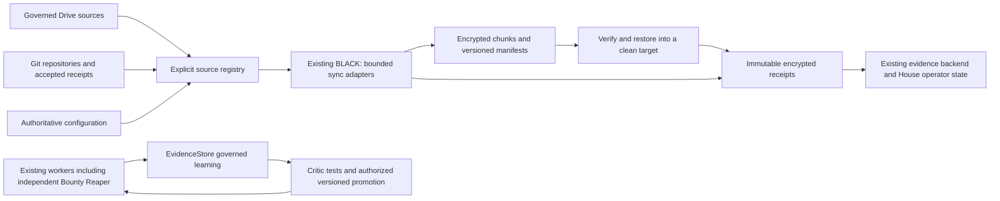

# Existing Matrix with continuity extensions

Root retains reconciliation authority. OVERDRIVE retains transport/evidence routing.
Mirrors retain source authority metadata but carry `role=MIRROR_RECOVERY` themselves.
No provider or recovery copy becomes Canon by being available. Historical
black-control remains provenance; installation must not activate it alongside BLACK.
The existing live House stays the operator surface; private recovery inventory is
authenticated/local, public health contains only an explicit safe field set.
